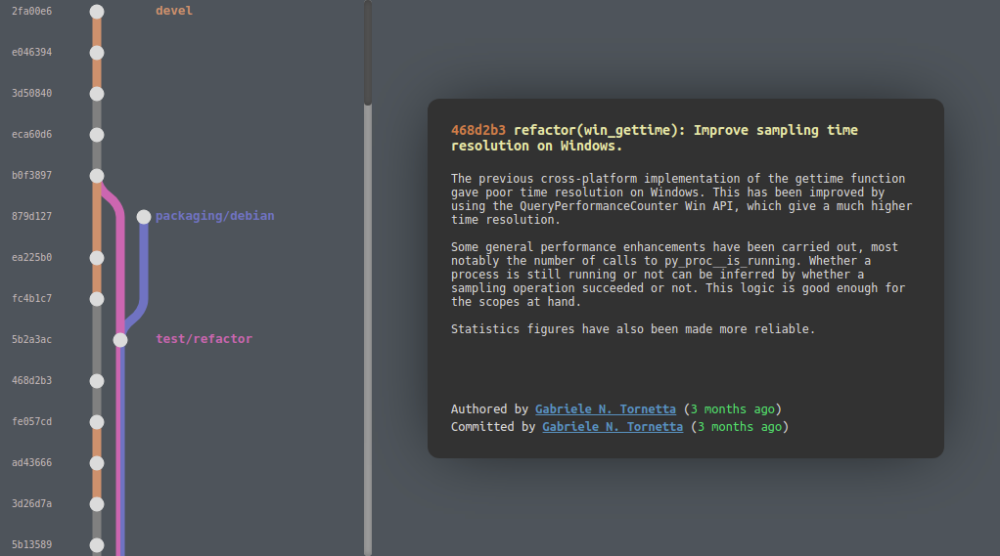

<h1 align="center">Git Railway</h1>

<h3 align="center">Visualise local git branches as neat interactive HTML pages</h3>

  
  &nbsp;&nbsp;&nbsp;&nbsp;
  
  &nbsp;&nbsp;&nbsp;&nbsp;
  

  <!--  -->
	
  <!--  -->
  
  

  <!-- <a href="#synopsis"><b>Synopsis</b></a>&nbsp;&bull; -->
  <a href="#installation"><b>Installation</b></a>&nbsp;&bull;
  <a href="#usage"><b>Usage</b></a>&nbsp;&bull;
  <a href="#details"><b>Details</b></a>
	<!-- &nbsp;&bull; -->
  <!-- <a href="#compatibility"><b>Compatibility</b></a>&nbsp;&bull;
  <a href="#contribute"><b>Contribute</b></a> -->

	

# Installation

Git Railway is available from PyPI

~~~
pip install git-railway
~~~

# Usage

Navigate to a git repository, or any sub-folder, and run

~~~ shell
git-railway
~~~

Your railway graph will be generated in `railway.html`. Use the `-o` or
`--output` option to override the default location, e.g.

~~~ shell
git-railway --output /tmp/mytemprailwaygraph.html
~~~

If you want to include all the remote branches to the railway graph, you can
pass the `-a` or `--all` option, e.g.

~~~ shell
git-railway --all
~~~

If the remote repository is hosted on GitHub, issue and PR
references are replaced with actual links. If the GitHub slug derived from the
remotes is wrong, you can override it with the `--gh` option, e.g.

~~~ shell
git-railway --gh p403n1x87/git-railway
~~~

# Details

## There's no such thing as *branch* in Git!

As you probably know already, a branch in git is a mere reference (or label)
that moves with every new commit. As such, it's hard if not impossible to
reconstruct the *actual* branch from the information available from within a git
repository. This tools works by looking at the current local refs and collecting
all the commits that can be reached from them. The "branches" are the
reconstructed "best effort" by looking at the reflog to determine on which
commit a certain ref has been on. Sometimes this information is missing. For
example, when one does a merge by fast-forwarding, all the intermediate commits
are not marked with the ref of the target branch. Should they be part of the
branch or not? Whenever you see a piece of grey rail in the graph, that's where
the ref information is missing.

## Chrono-topological ordering

To complicate things even more, there can be cases where a parent commit has a
timestamp which is in the *future* with respect to some of its children. Hence,
the trivial chronological ordering does not always work. Furthermore, one can
also have precision issues; if one creates multiple commits in quick succession,
they are likely to end up having the same timestamp. Topological order, on the
other hand, is not optimal either in its own. For what if we have some stale
branches that were never merged? They might end up at the very top of the graph,
even though its commits are quite old.

The solution is a mix of chronological and topological sorting. For example, we
can start by sorting all the commits based on their timestamp, and then make
some changes to Kahn's algorithm to ensure that we position oldest commits
first. With the chronological sorting step at the beginning, the complexity is
`O(n log n)`.
