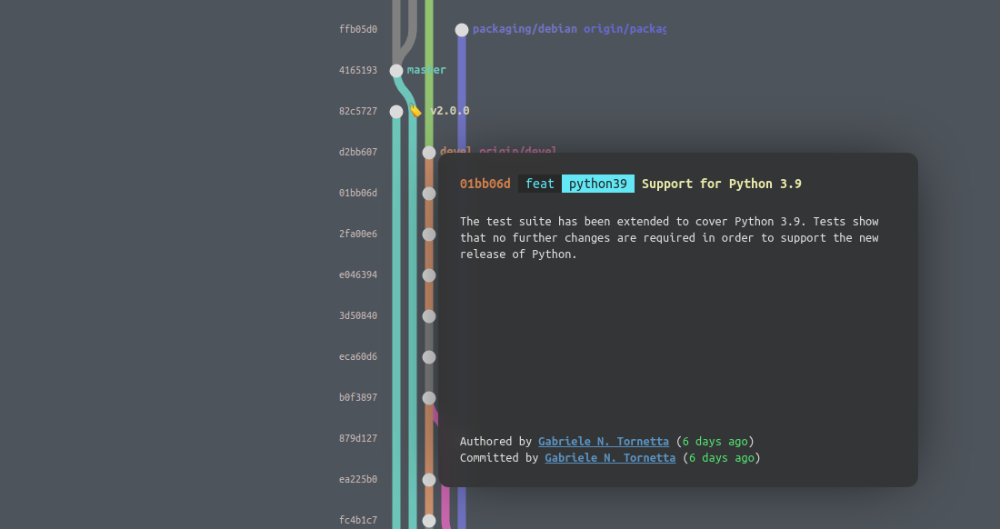

<h1 align="center">Git Railway</h1>

<h3 align="center">Visualise local git branches as neat interactive HTML pages</h3>

  
  &nbsp;&nbsp;&nbsp;&nbsp;
  
  &nbsp;&nbsp;&nbsp;&nbsp;
  

  <!--  -->
  
  <!--  -->
  
  

  <!-- <a href="#synopsis"><b>Synopsis</b></a>&nbsp;&bull; -->
  <a href="#installation"><b>Installation</b></a>&nbsp;&bull;
  <a href="#usage"><b>Usage</b></a>
	<!-- &nbsp;&bull; -->
  <!-- <a href="#compatibility"><b>Compatibility</b></a>&nbsp;&bull;
  <a href="#contribute"><b>Contribute</b></a> -->

	

# Installation

Installation from the repository requires Poetry

~~~
pip install poetry https://github.com/p403n1x87/git-railway
~~~

Soon available from PyPI!

# Usage

Navigate to a git repository and run

~~~ shell
git-railway
~~~

Your railway graph will be generated in `railway.html`. Use the `-o` or `--output` option to override the default location, e.g.

~~~ shell
git-railway --output /tmp/mytemprailwaygraph.html
~~~

If the remote repository is hosted on GitHub, you can have issue and PR references replaced with actual links if you pass the GitHub slug using the `--gh` option, e.g.

~~~ shell
git-railway --gh p403n1x87/git-railway
~~~
